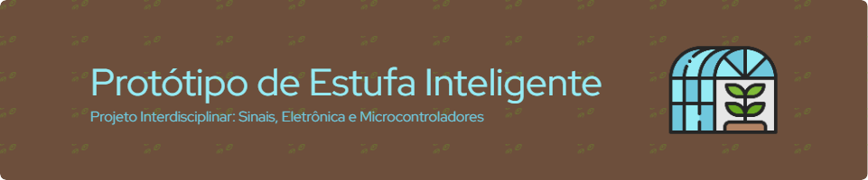

<div align="center" style="display: inline_block">
  
  
  
  
</div>

<br>
<h1 align="center">
    <a>
        
    </a>
</h1>

## 🗂️ Estrutura do Repositório

- `artigo/`: Diretório contendo o artigo do projeto em formato PDF.
- `source/`: Diretório com os scripts Python e Arduino utilizados no projeto.
- `imagens/`: Diretório com as imagens utilizadas no artigo e repositório.
- `apresentacao/`: Diretório com o arquivo da apresentação.
- **Simulação Online**: A simulação do projeto pode ser acessada através do [Tinkercad](https://www.tinkercad.com/things/6Jpl77eWDa1-estufa-inteligente-versao-final?sharecode=UGfbGy0ObKB1K_vF5VtieTPYHWlyQqe-wF_cfRtBV7w).

## 📝 Resumo

<p align="center">
 
</p>
<p align="center">
<em>Figura 1: Protótipo final da estufa com a tampa aberta.</em>
</p>

<div align="justify">
O presente trabalho descreve o desenvolvimento do protótipo de uma estufa inteligente automatizada para controle de temperatura e umidade, utilizando tecnologias como Arduino Uno, sensores de temperatura (LM35) e umidade do solo. Além disso, o estudo incluiu a análise dos sinais gerados pelos sensores, aplicando técnicas como ajuste senoidal e transformadas de Laplace e Fourier. O sistema permite o monitoramento e controle automático desses parâmetros, acionando cooler, lâmpada e bomba de água conforme os valores de referência estabelecidos. Destinado a projetos acadêmicos e experimentais, o protótipo oferece uma solução simples para o controle de clima em pequenos ambientes. Os resultados demonstram que a estufa se destaca como uma solução promissora para automação e monitoramento de variáveis do ambiente de forma prática e acessível.
</div>

## 🔄 Compilação e Execução 

### Arduino

1. Certifique-se de instalar a IDE do Arduino e conecte a placa ao computador.
2. Abra os arquivos `.ino` na IDE do Arduino.
3. Selecione a placa e a porta corretas em `Ferramentas`.
4. Instale bibliotecas adicionais, se necessário.
5. Verifique e carregue o código para o Arduino.

Após o upload, o código será executado automaticamente e pode ser monitorado via `Monitor Serial`.

### Python

<div align="justify">
Para executar os arquivos <code>.py</code>, siga os passos abaixo:

- Abra o terminal no diretório onde os arquivos do projeto estão localizados.
- Certifique-se de que as bibliotecas `numpy`, `matplotlib`, `scipy` e `sympy` estão instaladas. Se não estiverem instaladas, você pode instalar essas bibliotecas manualmente utilizando o seguinte comando:

```bash
pip install networkx matplotlib scipy sympy
```

- Em seguida, execute o programa com o comando:

```bash
python sinais.py
```

Isso irá executar o arquivo `sinais.py`, que automaticamente gerara o ajuste senoidal dos dados, o diagrama de bode e o espectro de frequência da temperatura.
</div>

## 📞 Contato

<table align="center">
  <tr>
    <th>Participante</th>
    <th>Contato</th>
  </tr>
  <tr>
    <td>Celso Vinícius</td>
    <td><a href="https://t.me/celso_vsf"> </td>
  </tr>
  <tr>
    <td>Felipe Werneck</td>
    <td><a href="https://t.me/"> </td>
  </tr>
  <tr>
    <td>Felipe Parreiras</td>
    <td><a href="https://t.me/"> </td>
  </tr>
  <tr>
    <td>José Marconi</td>
    <td><a href="https://t.me/"> </td>
  </tr>
  <tr>
    <td>Lucas Fernande</td>
    <td><a href="https://t.me/"> </td>
  </tr>
  <tr>
    <td>Thaissa Vitória</td>
    <td><a href="https://t.me/"> </td>
  </tr>
</table>